# Entity Relationship Diagram (ERD)
## SPMB Terpadu Tahun Pelajaran 2026/2027

**Versi:** 1.0  
**Status:** Draft Utama  
**Referensi:** `PRD_SPMB_Terpadu_2026_2027.md`  
**Database:** PostgreSQL  
**Arsitektur:** Modular Monolith  
**Backend:** Django + Django REST Framework + Django ORM (lihat `AGENTS.md` §1 untuk catatan migrasi dari FastAPI)

---

# 1. Tujuan Dokumen

Dokumen ini mendefinisikan model data utama untuk sistem SPMB Terpadu 2026/2027.

ERD dirancang untuk mendukung alur:

**Akun → Pendaftaran → Dokumen → Verifikasi → Seleksi → Pengumuman → Daftar Ulang → Pembayaran → Enrollment → MPLS → Siswa Resmi**

Prinsip desain:

- relational-first;
- UUID untuk primary key;
- auditability;
- configurable workflow;
- reusable antar tahun pelajaran;
- tidak mengulang data tanpa alasan;
- mendukung historisasi;
- siap dikembangkan ke integrasi LMS/SIS/EMIS.

---

# 2. Konvensi Database

## 2.1 Primary Key

Semua tabel utama menggunakan:

```text
id UUID PRIMARY KEY
```

Rekomendasi PostgreSQL:

```sql
gen_random_uuid()
```

---

## 2.2 Timestamp

Semua tabel utama minimal memiliki:

```text
created_at TIMESTAMPTZ
updated_at TIMESTAMPTZ
```

Untuk data yang perlu soft delete:

```text
deleted_at TIMESTAMPTZ NULL
```

---

## 2.3 Naming Convention

Gunakan:

```text
snake_case
plural_table_names
```

Contoh:

```text
application_documents
selection_components
mpls_attendances
```

---

## 2.4 Enum

Status penting sebaiknya menggunakan enum aplikasi yang konsisten.

Contoh:

```text
application_status
document_status
payment_status
attendance_status
```

Boleh disimpan sebagai PostgreSQL ENUM atau VARCHAR + constraint.

---

# 3. High-Level ERD

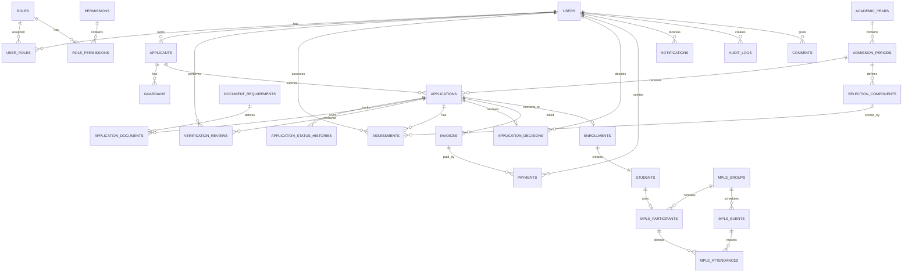

---

# 4. Domain: Authentication & Authorization

## 4.1 `users`

Menyimpan akun seluruh pengguna sistem.

```text
users
-----
id UUID PK
name VARCHAR(150)
email VARCHAR(255) UNIQUE NULL
phone VARCHAR(30) UNIQUE NULL
password_hash TEXT
email_verified_at TIMESTAMPTZ NULL
phone_verified_at TIMESTAMPTZ NULL
is_active BOOLEAN DEFAULT TRUE
last_login_at TIMESTAMPTZ NULL
created_at TIMESTAMPTZ
updated_at TIMESTAMPTZ
```

Catatan:

- minimal salah satu dari `email` atau `phone` harus tersedia;
- password tidak pernah disimpan dalam bentuk plaintext;
- akun orang tua dan akun admin menggunakan tabel yang sama.

---

## 4.2 `roles`

```text
roles
-----
id UUID PK
name VARCHAR(100) UNIQUE
code VARCHAR(100) UNIQUE
description TEXT NULL
is_system BOOLEAN DEFAULT FALSE
created_at TIMESTAMPTZ
updated_at TIMESTAMPTZ
```

Contoh:

```text
super_admin
admission_admin
verifier
finance
assessor
principal
mpls_officer
parent
```

---

## 4.3 `permissions`

```text
permissions
-----------
id UUID PK
code VARCHAR(150) UNIQUE
name VARCHAR(150)
description TEXT NULL
created_at TIMESTAMPTZ
updated_at TIMESTAMPTZ
```

Contoh:

```text
application.read
application.verify
application.override
payment.verify
assessment.input
assessment.approve
announcement.publish
mpls.manage
audit.read
```

---

## 4.4 `user_roles`

```text
user_roles
----------
id UUID PK
user_id UUID FK -> users.id
role_id UUID FK -> roles.id
created_at TIMESTAMPTZ
```

Constraint:

```text
UNIQUE(user_id, role_id)
```

---

## 4.5 `role_permissions`

```text
role_permissions
----------------
id UUID PK
role_id UUID FK -> roles.id
permission_id UUID FK -> permissions.id
created_at TIMESTAMPTZ
```

Constraint:

```text
UNIQUE(role_id, permission_id)
```

---

## 4.6 ERD Auth

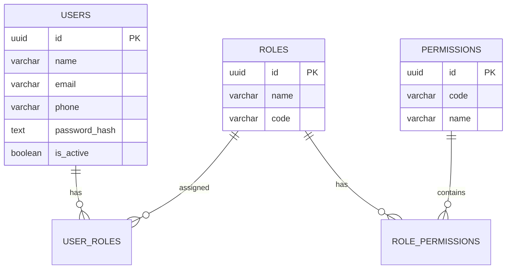

---

# 5. Domain: Academic Year & Admission Period

## 5.1 `academic_years`

```text
academic_years
--------------
id UUID PK
name VARCHAR(50)
start_date DATE
end_date DATE
is_active BOOLEAN DEFAULT FALSE
created_at TIMESTAMPTZ
updated_at TIMESTAMPTZ
```

Contoh:

```text
2026/2027
```

Constraint rekomendasi:

```text
hanya satu academic_year aktif pada satu waktu
```

---

## 5.2 `admission_periods`

Mewakili gelombang/jalur pendaftaran.

```text
admission_periods
-----------------
id UUID PK
academic_year_id UUID FK -> academic_years.id
name VARCHAR(150)
code VARCHAR(100)
registration_start TIMESTAMPTZ
registration_end TIMESTAMPTZ
announcement_at TIMESTAMPTZ NULL
quota INTEGER NULL
is_active BOOLEAN DEFAULT TRUE
settings JSONB NULL
created_at TIMESTAMPTZ
updated_at TIMESTAMPTZ
```

Contoh:

```text
Gelombang 1
Gelombang 2
Jalur Prestasi
Jalur Reguler
```

`settings` hanya untuk konfigurasi fleksibel tambahan, bukan menggantikan kolom inti.

---

## 5.3 ERD Periode

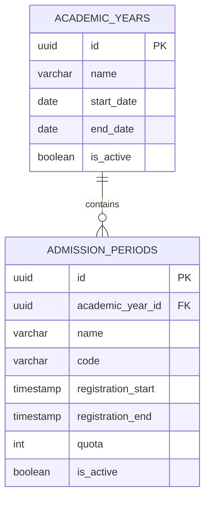

---

# 6. Domain: Applicant & Guardian

## 6.1 `applicants`

Menyimpan identitas calon siswa.

```text
applicants
----------
id UUID PK
owner_user_id UUID FK -> users.id
nisn VARCHAR(20) NULL
full_name VARCHAR(200)
nickname VARCHAR(100) NULL
gender VARCHAR(20)
birth_place VARCHAR(150)
birth_date DATE
religion VARCHAR(50) NULL
nationality VARCHAR(50) DEFAULT 'Indonesia'
nik VARCHAR(30) NULL
family_card_number VARCHAR(30) NULL

address TEXT
province VARCHAR(100) NULL
city VARCHAR(100) NULL
district VARCHAR(100) NULL
village VARCHAR(100) NULL
postal_code VARCHAR(10) NULL

previous_school_name VARCHAR(200) NULL
previous_school_npsn VARCHAR(30) NULL
previous_school_address TEXT NULL

created_at TIMESTAMPTZ
updated_at TIMESTAMPTZ
```

Catatan:

- data sensitif harus dibatasi aksesnya;
- `owner_user_id` adalah akun orang tua/wali yang mengelola data.

---

## 6.2 `guardians`

Menyimpan ayah, ibu, atau wali.

```text
guardians
---------
id UUID PK
applicant_id UUID FK -> applicants.id
relationship VARCHAR(30)
full_name VARCHAR(200)
nik VARCHAR(30) NULL
phone VARCHAR(30) NULL
email VARCHAR(255) NULL
occupation VARCHAR(150) NULL
education VARCHAR(100) NULL
monthly_income NUMERIC(15,2) NULL
address TEXT NULL
is_primary_contact BOOLEAN DEFAULT FALSE
created_at TIMESTAMPTZ
updated_at TIMESTAMPTZ
```

Nilai `relationship`:

```text
FATHER
MOTHER
GUARDIAN
```

---

## 6.3 ERD Applicant

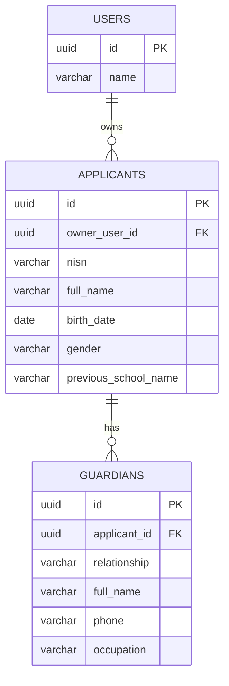

---

# 7. Domain: Application / Registration

## 7.1 `applications`

Tabel inti proses penerimaan.

```text
applications
------------
id UUID PK
applicant_id UUID FK -> applicants.id
admission_period_id UUID FK -> admission_periods.id

registration_number VARCHAR(50) UNIQUE
status VARCHAR(50)

submitted_at TIMESTAMPTZ NULL
verified_at TIMESTAMPTZ NULL
assessed_at TIMESTAMPTZ NULL
decided_at TIMESTAMPTZ NULL
enrolled_at TIMESTAMPTZ NULL

current_step INTEGER DEFAULT 1
completion_percentage INTEGER DEFAULT 0

created_at TIMESTAMPTZ
updated_at TIMESTAMPTZ
```

Status:

```text
DRAFT
SUBMITTED
UNDER_VERIFICATION
REVISION_REQUIRED
RESUBMITTED
VERIFIED
ASSESSMENT_SCHEDULED
ASSESSED
ACCEPTED
WAITLISTED
REJECTED
RE_REGISTRATION
RE_REGISTRATION_VERIFIED
ENROLLED
MPLS_ACTIVE
MPLS_COMPLETED
COMPLETED
```

Constraint:

```text
UNIQUE(applicant_id, admission_period_id)
```

Jika kebijakan memperbolehkan lebih dari satu aplikasi per periode, constraint dapat disesuaikan.

---

## 7.2 `application_status_histories`

```text
application_status_histories
----------------------------
id UUID PK
application_id UUID FK -> applications.id
from_status VARCHAR(50) NULL
to_status VARCHAR(50)
changed_by UUID FK -> users.id NULL
reason TEXT NULL
metadata JSONB NULL
created_at TIMESTAMPTZ
```

Tujuan:

- histori;
- audit;
- timeline peserta;
- troubleshooting.

---

## 7.3 ERD Application

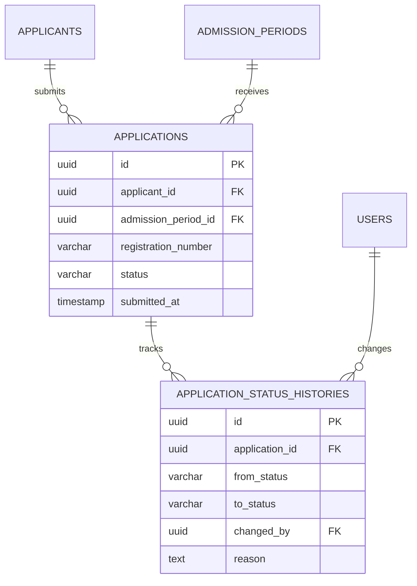

---

# 8. Domain: Document Management

## 8.1 `document_requirements`

Mendefinisikan dokumen yang wajib/opsional.

```text
document_requirements
---------------------
id UUID PK
admission_period_id UUID FK -> admission_periods.id NULL
name VARCHAR(150)
code VARCHAR(100)
description TEXT NULL

is_required BOOLEAN DEFAULT TRUE
allowed_mime_types JSONB
max_file_size_bytes BIGINT

is_active BOOLEAN DEFAULT TRUE
sort_order INTEGER DEFAULT 0

created_at TIMESTAMPTZ
updated_at TIMESTAMPTZ
```

Jika `admission_period_id = NULL`, requirement dapat dianggap global.

---

## 8.2 `application_documents`

```text
application_documents
---------------------
id UUID PK
application_id UUID FK -> applications.id
requirement_id UUID FK -> document_requirements.id

storage_key TEXT
original_filename VARCHAR(255)
mime_type VARCHAR(100)
file_size BIGINT
checksum VARCHAR(128) NULL

status VARCHAR(30)
uploaded_at TIMESTAMPTZ
verified_at TIMESTAMPTZ NULL
verified_by UUID FK -> users.id NULL
verification_note TEXT NULL

version INTEGER DEFAULT 1

created_at TIMESTAMPTZ
updated_at TIMESTAMPTZ
```

Status:

```text
PENDING
VALID
INVALID
REVISION_REQUIRED
```

Dokumen revisi boleh dibuat sebagai versi baru agar histori file tetap tersedia.

---

## 8.3 `document_revisions`

Opsional tetapi direkomendasikan jika ingin histori revisi eksplisit.

```text
document_revisions
------------------
id UUID PK
application_document_id UUID FK -> application_documents.id
requested_by UUID FK -> users.id
reason TEXT
resolved_at TIMESTAMPTZ NULL
created_at TIMESTAMPTZ
```

---

## 8.4 ERD Dokumen

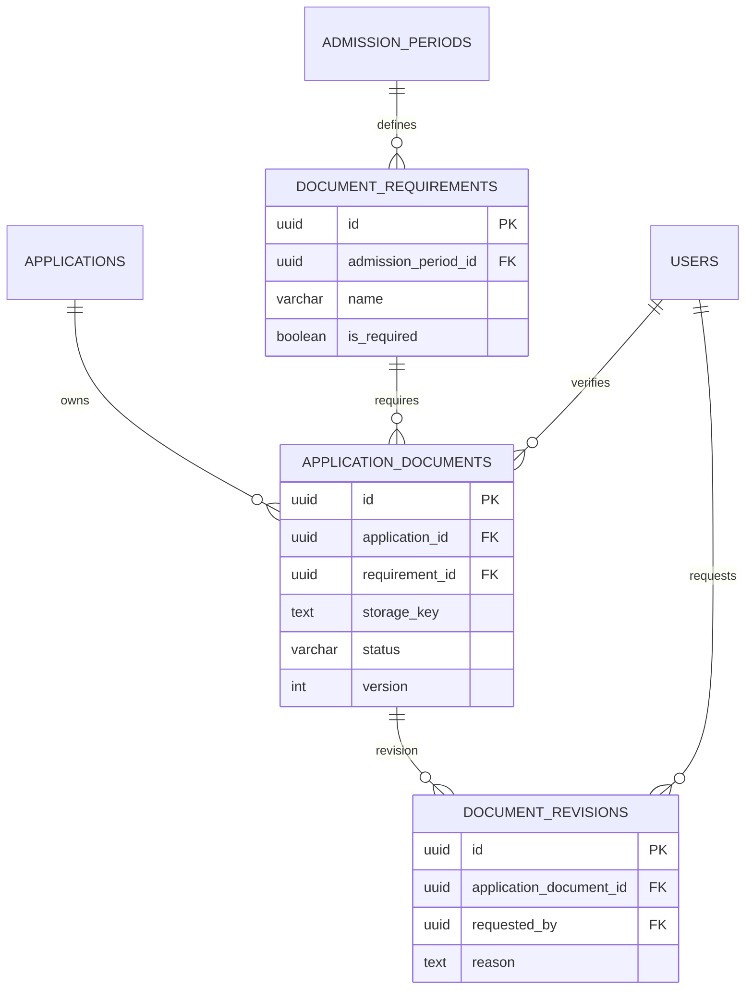

---

# 9. Domain: Verification

## 9.1 `verification_reviews`

Menyimpan review aplikasi secara keseluruhan.

```text
verification_reviews
--------------------
id UUID PK
application_id UUID FK -> applications.id
verifier_id UUID FK -> users.id
status VARCHAR(30)
notes TEXT NULL
started_at TIMESTAMPTZ NULL
completed_at TIMESTAMPTZ NULL
created_at TIMESTAMPTZ
updated_at TIMESTAMPTZ
```

Status:

```text
PENDING
IN_PROGRESS
REVISION_REQUIRED
VERIFIED
REJECTED
```

---

## 9.2 `verification_assignments`

Untuk work queue verifikator.

```text
verification_assignments
------------------------
id UUID PK
application_id UUID FK -> applications.id
verifier_id UUID FK -> users.id
assigned_by UUID FK -> users.id
assigned_at TIMESTAMPTZ
completed_at TIMESTAMPTZ NULL
created_at TIMESTAMPTZ
```

---

## 9.3 ERD Verification

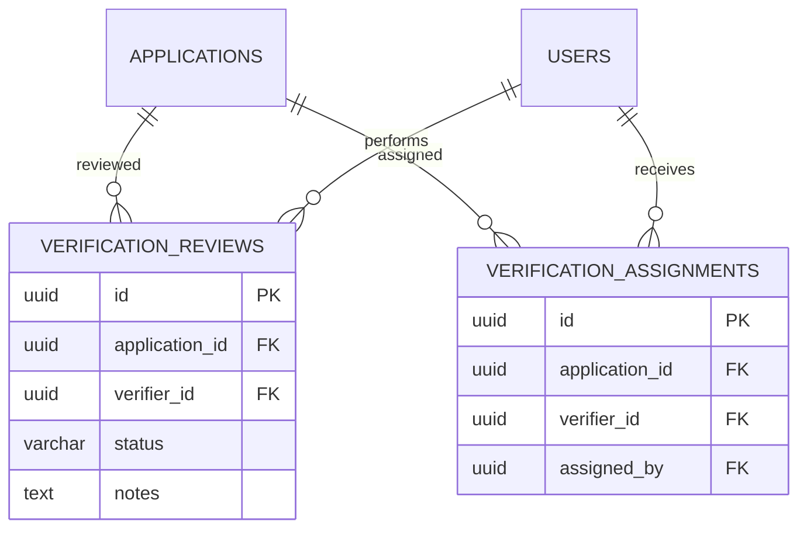

---

# 10. Domain: Selection & Assessment

## 10.1 `selection_components`

Komponen penilaian configurable.

```text
selection_components
--------------------
id UUID PK
admission_period_id UUID FK -> admission_periods.id
name VARCHAR(150)
code VARCHAR(100)
description TEXT NULL

weight NUMERIC(5,2)
max_score NUMERIC(8,2)
minimum_score NUMERIC(8,2) NULL

sort_order INTEGER DEFAULT 0
is_active BOOLEAN DEFAULT TRUE

created_at TIMESTAMPTZ
updated_at TIMESTAMPTZ
```

Constraint:

```text
0 <= weight <= 100
```

Total bobot seluruh komponen aktif sebaiknya 100%.

---

## 10.2 `assessment_schedules`

```text
assessment_schedules
--------------------
id UUID PK
application_id UUID FK -> applications.id
component_id UUID FK -> selection_components.id
scheduled_at TIMESTAMPTZ
location VARCHAR(255) NULL
room VARCHAR(100) NULL
notes TEXT NULL
status VARCHAR(30)
created_at TIMESTAMPTZ
updated_at TIMESTAMPTZ
```

---

## 10.3 `assessments`

```text
assessments
-----------
id UUID PK
application_id UUID FK -> applications.id
component_id UUID FK -> selection_components.id
assessor_id UUID FK -> users.id

score NUMERIC(8,2)
weighted_score NUMERIC(10,4) NULL
notes TEXT NULL

assessed_at TIMESTAMPTZ
created_at TIMESTAMPTZ
updated_at TIMESTAMPTZ
```

Constraint:

```text
score >= 0
score <= selection_components.max_score
```

---

## 10.4 `application_scores`

Opsional sebagai tabel agregasi/cache hasil perhitungan.

```text
application_scores
------------------
id UUID PK
application_id UUID FK -> applications.id UNIQUE
raw_score NUMERIC(12,4)
final_score NUMERIC(12,4)
rank INTEGER NULL
calculated_at TIMESTAMPTZ
created_at TIMESTAMPTZ
updated_at TIMESTAMPTZ
```

Ranking sebaiknya dapat dihitung ulang.

---

## 10.5 ERD Selection

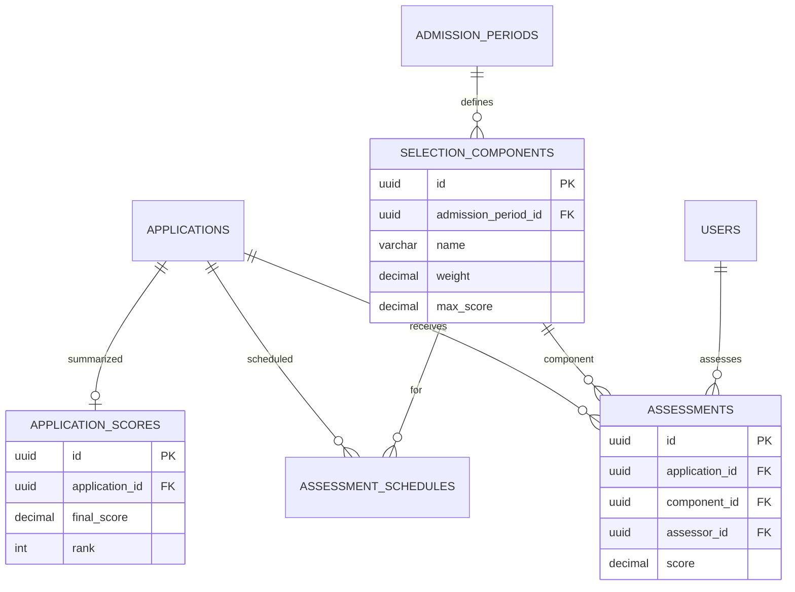

---

# 11. Domain: Decision & Waiting List

## 11.1 `application_decisions`

```text
application_decisions
---------------------
id UUID PK
application_id UUID FK -> applications.id UNIQUE
decision VARCHAR(30)
final_score NUMERIC(12,4) NULL
rank INTEGER NULL
decided_by UUID FK -> users.id
reason TEXT NULL
published_at TIMESTAMPTZ NULL
created_at TIMESTAMPTZ
updated_at TIMESTAMPTZ
```

Decision:

```text
ACCEPTED
WAITLISTED
REJECTED
```

---

## 11.2 `waiting_list_entries`

```text
waiting_list_entries
--------------------
id UUID PK
application_id UUID FK -> applications.id UNIQUE
position INTEGER
score NUMERIC(12,4)
status VARCHAR(30)
promoted_at TIMESTAMPTZ NULL
promoted_by UUID FK -> users.id NULL
created_at TIMESTAMPTZ
updated_at TIMESTAMPTZ
```

Status:

```text
WAITING
PROMOTED
EXPIRED
CANCELLED
```

---

## 11.3 `decision_histories`

Direkomendasikan untuk override.

```text
decision_histories
------------------
id UUID PK
application_decision_id UUID FK -> application_decisions.id
old_decision VARCHAR(30)
new_decision VARCHAR(30)
changed_by UUID FK -> users.id
reason TEXT
created_at TIMESTAMPTZ
```

---

## 11.4 ERD Decision

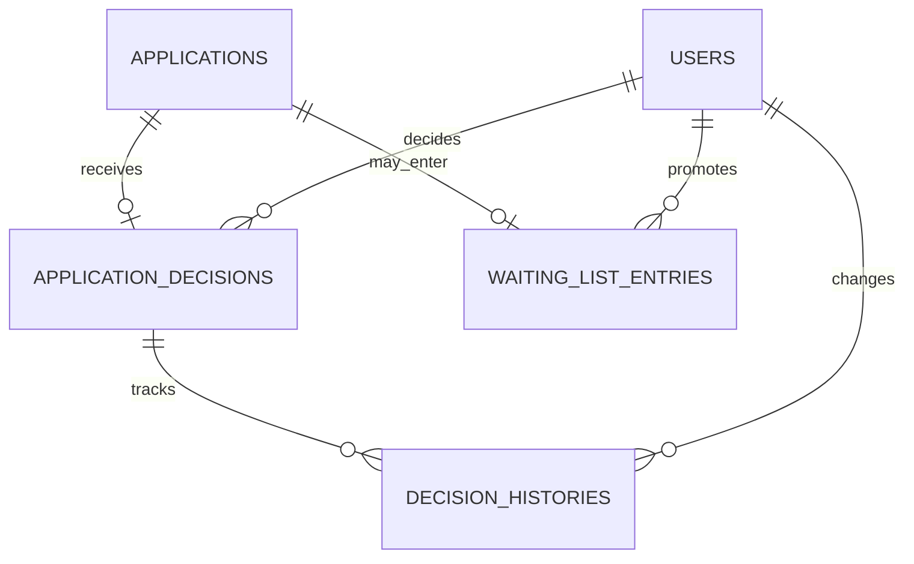

---

# 12. Domain: Re-registration

## 12.1 `re_registrations`

```text
re_registrations
----------------
id UUID PK
application_id UUID FK -> applications.id UNIQUE
status VARCHAR(30)
confirmed_at TIMESTAMPTZ NULL
completed_at TIMESTAMPTZ NULL
notes TEXT NULL
created_at TIMESTAMPTZ
updated_at TIMESTAMPTZ
```

Status:

```text
PENDING
IN_PROGRESS
COMPLETED
CANCELLED
EXPIRED
```

---

## 12.2 `re_registration_requirements`

```text
re_registration_requirements
----------------------------
id UUID PK
admission_period_id UUID FK -> admission_periods.id
name VARCHAR(150)
code VARCHAR(100)
is_required BOOLEAN DEFAULT TRUE
sort_order INTEGER DEFAULT 0
created_at TIMESTAMPTZ
updated_at TIMESTAMPTZ
```

---

## 12.3 `re_registration_items`

```text
re_registration_items
---------------------
id UUID PK
re_registration_id UUID FK -> re_registrations.id
requirement_id UUID FK -> re_registration_requirements.id
status VARCHAR(30)
notes TEXT NULL
completed_at TIMESTAMPTZ NULL
created_at TIMESTAMPTZ
updated_at TIMESTAMPTZ
```

---

# 13. Domain: Invoice & Payment

## 13.1 `invoices`

```text
invoices
--------
id UUID PK
application_id UUID FK -> applications.id
invoice_number VARCHAR(50) UNIQUE
type VARCHAR(50)
amount NUMERIC(15,2)
due_date TIMESTAMPTZ NULL
status VARCHAR(30)
description TEXT NULL
created_at TIMESTAMPTZ
updated_at TIMESTAMPTZ
```

Status:

```text
UNPAID
PARTIALLY_PAID
PAID
EXPIRED
CANCELLED
```

---

## 13.2 `payments`

```text
payments
--------
id UUID PK
invoice_id UUID FK -> invoices.id
amount NUMERIC(15,2)
method VARCHAR(50)
reference_number VARCHAR(100) NULL

proof_storage_key TEXT NULL

status VARCHAR(30)
paid_at TIMESTAMPTZ NULL
verified_at TIMESTAMPTZ NULL
verified_by UUID FK -> users.id NULL
verification_note TEXT NULL

created_at TIMESTAMPTZ
updated_at TIMESTAMPTZ
```

Status:

```text
PENDING
PAID
REJECTED
REFUNDED
```

---

## 13.3 `payment_histories`

```text
payment_histories
-----------------
id UUID PK
payment_id UUID FK -> payments.id
from_status VARCHAR(30) NULL
to_status VARCHAR(30)
changed_by UUID FK -> users.id NULL
notes TEXT NULL
created_at TIMESTAMPTZ
```

---

## 13.4 ERD Payment

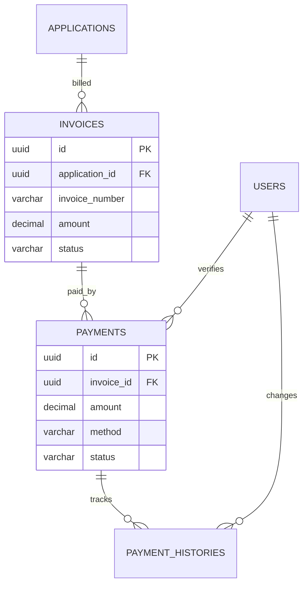

---

# 14. Domain: Enrollment & Student

## 14.1 `enrollments`

Menandai transformasi peserta menjadi siswa resmi.

```text
enrollments
-----------
id UUID PK
application_id UUID FK -> applications.id UNIQUE
status VARCHAR(30)
enrolled_at TIMESTAMPTZ
enrolled_by UUID FK -> users.id NULL
notes TEXT NULL
created_at TIMESTAMPTZ
updated_at TIMESTAMPTZ
```

Status:

```text
ACTIVE
CANCELLED
```

---

## 14.2 `students`

```text
students
--------
id UUID PK
enrollment_id UUID FK -> enrollments.id UNIQUE
student_number VARCHAR(50) UNIQUE
nisn VARCHAR(20) NULL
full_name VARCHAR(200)
gender VARCHAR(20)
birth_place VARCHAR(150)
birth_date DATE

status VARCHAR(30)

created_at TIMESTAMPTZ
updated_at TIMESTAMPTZ
```

Catatan:

Data inti siswa boleh disalin dari applicant saat enrollment sebagai snapshot operasional.

Histori aplikasi tetap disimpan di `applications`.

---

## 14.3 ERD Enrollment

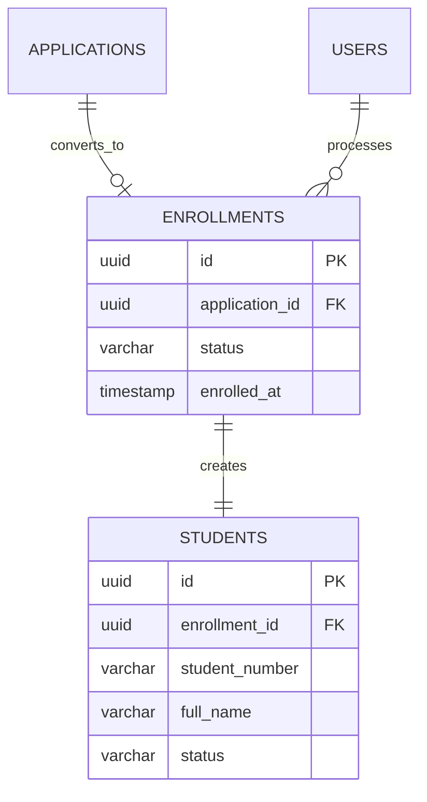

---

# 15. Domain: MPLS

## 15.1 `mpls_groups`

```text
mpls_groups
-----------
id UUID PK
academic_year_id UUID FK -> academic_years.id
name VARCHAR(150)
code VARCHAR(50)
capacity INTEGER NULL
mentor_name VARCHAR(200) NULL
description TEXT NULL
created_at TIMESTAMPTZ
updated_at TIMESTAMPTZ
```

---

## 15.2 `mpls_participants`

```text
mpls_participants
-----------------
id UUID PK
student_id UUID FK -> students.id UNIQUE
group_id UUID FK -> mpls_groups.id
qr_token VARCHAR(255) UNIQUE
status VARCHAR(30)
joined_at TIMESTAMPTZ
created_at TIMESTAMPTZ
updated_at TIMESTAMPTZ
```

Status:

```text
ACTIVE
COMPLETED
WITHDRAWN
```

---

## 15.3 `mpls_events`

```text
mpls_events
-----------
id UUID PK
group_id UUID FK -> mpls_groups.id NULL
title VARCHAR(200)
description TEXT NULL
start_at TIMESTAMPTZ
end_at TIMESTAMPTZ
location VARCHAR(255) NULL
is_mandatory BOOLEAN DEFAULT TRUE
created_at TIMESTAMPTZ
updated_at TIMESTAMPTZ
```

Jika `group_id = NULL`, event berlaku untuk seluruh kelompok.

---

## 15.4 `mpls_attendances`

```text
mpls_attendances
----------------
id UUID PK
event_id UUID FK -> mpls_events.id
participant_id UUID FK -> mpls_participants.id
status VARCHAR(30)
checked_at TIMESTAMPTZ NULL
checked_by UUID FK -> users.id NULL
notes TEXT NULL
created_at TIMESTAMPTZ
updated_at TIMESTAMPTZ
```

Status:

```text
PRESENT
SICK
PERMITTED
ABSENT
```

Constraint:

```text
UNIQUE(event_id, participant_id)
```

---

## 15.5 ERD MPLS

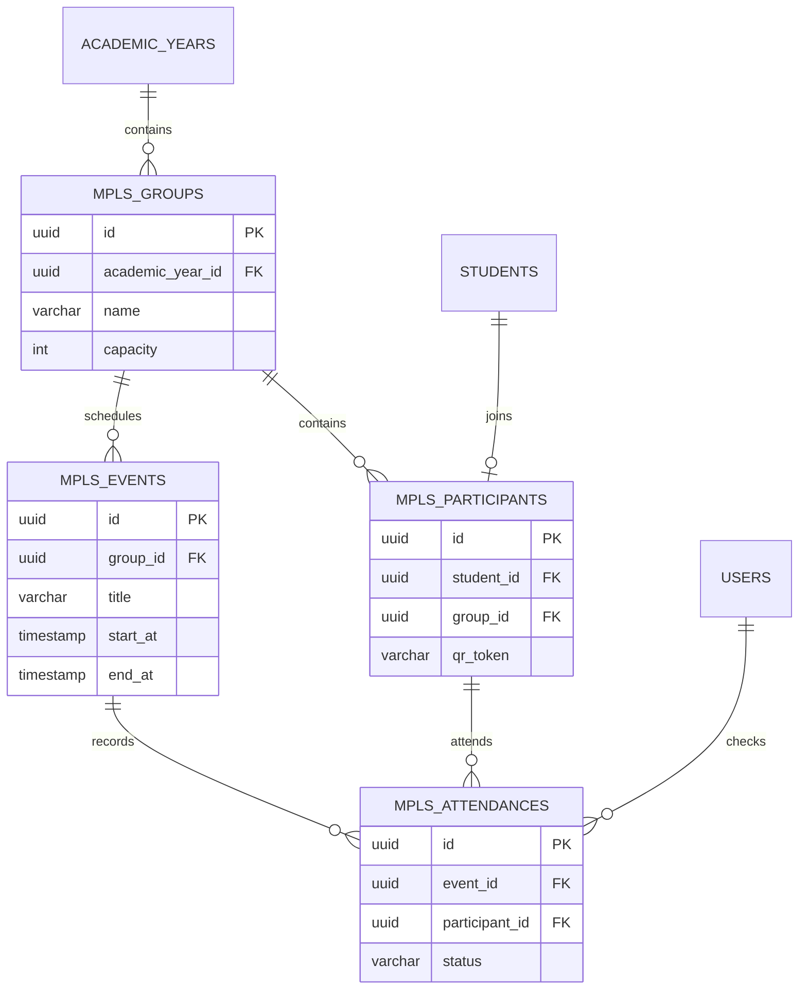

---

# 16. Domain: Notification

## 16.1 `notifications`

```text
notifications
-------------
id UUID PK
user_id UUID FK -> users.id
channel VARCHAR(30)
type VARCHAR(100)
title VARCHAR(200)
message TEXT
payload JSONB NULL
status VARCHAR(30)
sent_at TIMESTAMPTZ NULL
read_at TIMESTAMPTZ NULL
failed_at TIMESTAMPTZ NULL
failure_reason TEXT NULL
created_at TIMESTAMPTZ
updated_at TIMESTAMPTZ
```

Channel:

```text
IN_APP
EMAIL
WHATSAPP
```

Status:

```text
QUEUED
SENT
FAILED
READ
```

---

## 16.2 `notification_templates`

```text
notification_templates
----------------------
id UUID PK
code VARCHAR(100) UNIQUE
channel VARCHAR(30)
subject VARCHAR(255) NULL
body TEXT
is_active BOOLEAN DEFAULT TRUE
created_at TIMESTAMPTZ
updated_at TIMESTAMPTZ
```

---

# 17. Domain: Consent & Privacy

## 17.1 `consents`

```text
consents
--------
id UUID PK
user_id UUID FK -> users.id
applicant_id UUID FK -> applicants.id NULL
consent_type VARCHAR(100)
version VARCHAR(50)
accepted BOOLEAN
ip_address INET NULL
user_agent TEXT NULL
consented_at TIMESTAMPTZ
created_at TIMESTAMPTZ
```

Contoh:

```text
PRIVACY_POLICY
DATA_PROCESSING
COMMUNICATION_CONSENT
```

---

# 18. Domain: Audit Log

## 18.1 `audit_logs`

```text
audit_logs
----------
id UUID PK
user_id UUID FK -> users.id NULL

action VARCHAR(100)
resource_type VARCHAR(100)
resource_id UUID NULL

old_values JSONB NULL
new_values JSONB NULL
reason TEXT NULL

ip_address INET NULL
user_agent TEXT NULL
request_id VARCHAR(100) NULL

created_at TIMESTAMPTZ
```

Audit log tidak mempunyai `updated_at`.

Log sebaiknya append-only.

---

# 19. Domain: System Settings

## 19.1 `system_settings`

```text
system_settings
---------------
id UUID PK
key VARCHAR(150) UNIQUE
value JSONB
description TEXT NULL
is_public BOOLEAN DEFAULT FALSE
created_at TIMESTAMPTZ
updated_at TIMESTAMPTZ
```

Contoh:

```text
school.name
school.logo
admission.contact_phone
registration.auto_close
notification.whatsapp_enabled
```

Jangan simpan secret credential dalam tabel ini tanpa encryption/secret manager.

---

# 20. Full Core ERD

Diagram berikut menunjukkan hubungan utama antar domain.

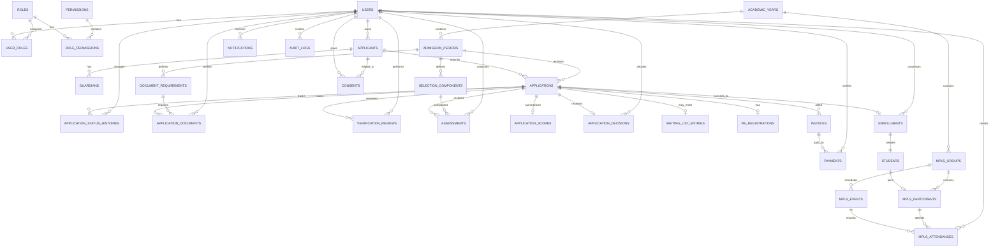

---

# 21. Relationship Summary

| Parent | Child | Relationship |
|---|---|---|
| users | applicants | 1 : N |
| applicants | guardians | 1 : N |
| academic_years | admission_periods | 1 : N |
| applicants | applications | 1 : N |
| admission_periods | applications | 1 : N |
| applications | application_status_histories | 1 : N |
| admission_periods | document_requirements | 1 : N |
| applications | application_documents | 1 : N |
| document_requirements | application_documents | 1 : N |
| applications | verification_reviews | 1 : N |
| admission_periods | selection_components | 1 : N |
| applications | assessments | 1 : N |
| selection_components | assessments | 1 : N |
| applications | application_decisions | 1 : 0..1 |
| applications | waiting_list_entries | 1 : 0..1 |
| applications | invoices | 1 : N |
| invoices | payments | 1 : N |
| applications | enrollments | 1 : 0..1 |
| enrollments | students | 1 : 1 |
| students | mpls_participants | 1 : 0..1 |
| mpls_groups | mpls_participants | 1 : N |
| mpls_events | mpls_attendances | 1 : N |

---

# 22. Recommended Indexes

Index penting:

```sql
CREATE INDEX idx_applications_status
ON applications(status);

CREATE INDEX idx_applications_admission_period
ON applications(admission_period_id);

CREATE INDEX idx_applications_registration_number
ON applications(registration_number);

CREATE INDEX idx_applicants_nisn
ON applicants(nisn);

CREATE INDEX idx_applicants_full_name
ON applicants(full_name);

CREATE INDEX idx_documents_application
ON application_documents(application_id);

CREATE INDEX idx_assessments_application
ON assessments(application_id);

CREATE INDEX idx_invoices_application
ON invoices(application_id);

CREATE INDEX idx_payments_invoice
ON payments(invoice_id);

CREATE INDEX idx_audit_resource
ON audit_logs(resource_type, resource_id);

CREATE INDEX idx_notifications_user_status
ON notifications(user_id, status);
```

Untuk pencarian nama, pertimbangkan trigram index PostgreSQL:

```sql
CREATE EXTENSION IF NOT EXISTS pg_trgm;
```

---

# 23. Unique Constraints

Rekomendasi:

```text
users.email UNIQUE
users.phone UNIQUE

roles.code UNIQUE
permissions.code UNIQUE

user_roles(user_id, role_id) UNIQUE
role_permissions(role_id, permission_id) UNIQUE

applications.registration_number UNIQUE

selection_components(admission_period_id, code) UNIQUE

application_scores.application_id UNIQUE
application_decisions.application_id UNIQUE
waiting_list_entries.application_id UNIQUE
re_registrations.application_id UNIQUE
enrollments.application_id UNIQUE

students.student_number UNIQUE

mpls_participants.student_id UNIQUE
mpls_participants.qr_token UNIQUE

mpls_attendances(event_id, participant_id) UNIQUE
```

---

# 24. Foreign Key Delete Strategy

Tidak semua FK menggunakan cascade.

## CASCADE Cocok

Contoh data teknis turunan:

```text
role_permissions
user_roles
```

---

## RESTRICT / NO ACTION Cocok

Data bisnis penting:

```text
applications
payments
enrollments
students
audit_logs
```

Data tersebut tidak boleh hilang hanya karena parent dihapus.

Untuk data bisnis utama, prefer:

```text
soft delete
archive
deactivate
```

dibanding hard delete.

---

# 25. Data yang Sebaiknya Tidak Di-hard Delete

- applicants;
- applications;
- application documents;
- assessments;
- decisions;
- payments;
- enrollments;
- students;
- audit logs.

Gunakan status atau `deleted_at` bila diperlukan.

---

# 26. JSONB Usage Policy

JSONB diperbolehkan untuk:

```text
metadata
audit old/new values
notification payload
period settings
integration payload
```

Jangan menggunakan JSONB untuk menggantikan entity yang memiliki struktur relasional jelas.

Contoh buruk:

```text
applications.data = {
    "student": {},
    "parents": {},
    "documents": [],
    "payments": []
}
```

Model tersebut akan menyulitkan validasi, query, reporting, dan indexing.

---

# 27. Sensitive Data Classification

## Sangat Sensitif

- NIK;
- nomor KK;
- dokumen keluarga;
- data anak;
- bukti pembayaran;
- kontak orang tua.

Akses dibatasi berdasarkan permission.

---

## Internal

- assessment score;
- verification notes;
- decision notes;
- ranking.

Tidak boleh ditampilkan ke peserta kecuali memang menjadi kebijakan sekolah.

---

## Public

- jadwal umum;
- informasi penerimaan;
- persyaratan;
- FAQ.

---

# 28. Data Lifecycle

```text
Parent Account
      ↓
Applicant
      ↓
Application
      ↓
Verification
      ↓
Assessment
      ↓
Decision
      ↓
Re-registration
      ↓
Enrollment
      ↓
Student
      ↓
MPLS Participant
```

Setiap tahapan tidak menghapus data tahapan sebelumnya.

Tujuannya agar seluruh sejarah penerimaan tetap dapat diaudit.

---

# 29. Recommended Module Ownership

Struktur modul backend:

```text
auth
├── users
├── roles
└── permissions

admission
├── academic_years
├── admission_periods
├── applicants
├── guardians
├── applications
└── status_history

documents
├── requirements
├── application_documents
└── revisions

verification
├── assignments
└── reviews

selection
├── components
├── schedules
├── assessments
├── scores
├── decisions
└── waiting_list

finance
├── invoices
└── payments

enrollment
├── re_registration
├── enrollments
└── students

mpls
├── groups
├── participants
├── events
└── attendances

communication
├── notifications
└── templates

system
├── settings
├── consents
└── audit_logs
```

---

# 30. Suggested Migration Order

Urutan migration direkomendasikan:

```text
001 users
002 roles
003 permissions
004 user_roles
005 role_permissions

006 academic_years
007 admission_periods

008 applicants
009 guardians
010 applications
011 application_status_histories

012 document_requirements
013 application_documents
014 document_revisions

015 verification_assignments
016 verification_reviews

017 selection_components
018 assessment_schedules
019 assessments
020 application_scores
021 application_decisions
022 decision_histories
023 waiting_list_entries

024 re_registrations
025 re_registration_requirements
026 re_registration_items

027 invoices
028 payments
029 payment_histories

030 enrollments
031 students

032 mpls_groups
033 mpls_participants
034 mpls_events
035 mpls_attendances

036 notification_templates
037 notifications

038 consents
039 system_settings
040 audit_logs
```

---

# 31. Recommended MVP Tables

Untuk fase MVP awal, tabel minimal:

```text
users
roles
permissions
user_roles
role_permissions

academic_years
admission_periods

applicants
guardians
applications
application_status_histories

document_requirements
application_documents

verification_reviews

selection_components
assessments
application_decisions

re_registrations

invoices
payments

enrollments
students

mpls_groups
mpls_participants
mpls_events
mpls_attendances

notifications
audit_logs
```

Tabel tambahan dapat menyusul sesuai fase.

---

# 32. Final Architectural Notes

Desain database ini menggunakan pendekatan:

```text
Modular Monolith
+
Relational Database
+
Configurable Business Rules
+
Historical Records
+
Append-only Audit
```

Tujuan utamanya bukan hanya membuat database yang bekerja, tetapi database yang tetap mudah dipahami setelah sistem berkembang beberapa tahun.

Prinsip terakhir:

> Data penerimaan adalah histori resmi proses masuk seorang siswa. Karena itu, setiap keputusan penting harus dapat ditelusuri kembali.

---

# 33. Dokumen Lanjutan

Setelah ERD ini, urutan dokumen yang direkomendasikan:

1. `USER_FLOW.md`
2. `STATE_MACHINE.md`
3. `API_SPECIFICATION.md`
4. `DATABASE_SCHEMA.md`
5. `RBAC_MATRIX.md`
6. `SECURITY_REQUIREMENTS.md`
7. `UI_UX_GUIDELINES.md`
8. `DEVELOPMENT_ROADMAP.md`
9. `TESTING_PLAN.md`

---

**End of ERD — Version 1.0**
