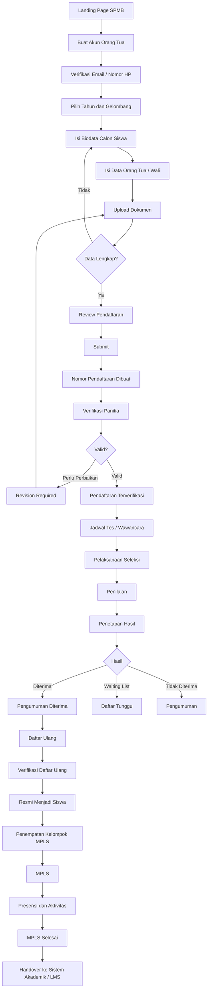

# Product Requirements Document (PRD)
## SPMB Terpadu Tahun Pelajaran 2026/2027

**Versi:** 1.0  
**Status:** Draft Utama  
**Jenis Produk:** Sistem Penerimaan Murid Baru Terpadu  
**Target Penggunaan:** Tahun Pelajaran 2026/2027  
**Platform:** Web Responsive / PWA-ready  
**Arsitektur Utama:** React + TypeScript + FastAPI + PostgreSQL

---

## 1. Ringkasan Produk

SPMB Terpadu adalah sistem penerimaan murid baru end-to-end yang mengelola seluruh proses sejak calon siswa pertama kali memperoleh informasi pendaftaran sampai resmi menjadi siswa dan menyelesaikan Masa Pengenalan Lingkungan Sekolah (MPLS).

Sistem dirancang agar seluruh aktivitas terpusat dalam satu platform:

**Informasi → Pendaftaran → Verifikasi → Seleksi → Pengumuman → Daftar Ulang → Enrollment → MPLS → Selesai**

Tujuan utamanya adalah menggantikan proses yang tersebar di Google Form, spreadsheet, WhatsApp pribadi, formulir kertas, file lokal, dan rekap manual menjadi satu sistem yang terkontrol, mudah digunakan, modern, aman, serta memiliki audit trail yang jelas.

---

## 2. Latar Belakang

Proses penerimaan siswa pada banyak sekolah masih menggunakan beberapa media yang tidak terintegrasi. Akibatnya dapat terjadi:

- duplikasi data;
- kesalahan input;
- berkas tercecer;
- status calon siswa sulit dilacak;
- komunikasi tidak konsisten;
- proses verifikasi lambat;
- rekap pembayaran manual;
- pengumuman tidak terpusat;
- aktivitas daftar ulang sulit dipantau;
- data MPLS tidak terhubung dengan data pendaftaran;
- pimpinan sulit mendapatkan gambaran real-time.

SPMB Terpadu dibangun untuk menyelesaikan masalah tersebut dengan workflow yang jelas dan satu sumber data utama.

---

## 3. Visi Produk

Membangun sistem penerimaan murid baru yang:

1. mudah digunakan oleh orang tua/wali;
2. efisien bagi panitia;
3. memberikan kontrol penuh kepada pengelola;
4. memiliki alur yang terukur dan transparan;
5. aman untuk data pribadi siswa;
6. dapat digunakan ulang setiap tahun;
7. fleksibel terhadap perubahan kebijakan sekolah;
8. dapat dikembangkan menjadi bagian dari ekosistem sistem sekolah.

---

## 4. Tujuan Produk

### 4.1 Tujuan Utama

- Memusatkan seluruh aktivitas SPMB dalam satu platform.
- Mengurangi pekerjaan manual panitia.
- Mengurangi penggunaan spreadsheet terpisah.
- Mempercepat proses verifikasi berkas.
- Memberikan status pendaftaran secara real-time.
- Mengelola seleksi secara terstruktur.
- Mengelola pengumuman dan daftar ulang dalam sistem.
- Mengubah peserta diterima menjadi data siswa tanpa input ulang.
- Mengelola kegiatan MPLS dari data siswa baru yang sama.
- Menyediakan laporan dan audit trail yang dapat dipertanggungjawabkan.

### 4.2 Sasaran Keberhasilan

Sistem dianggap berhasil apabila:

- minimal 95% proses pendaftaran dapat dilakukan tanpa bantuan langsung panitia;
- seluruh perubahan status pendaftaran tercatat;
- panitia dapat mengetahui posisi setiap calon siswa dalam workflow;
- tidak diperlukan input ulang data siswa setelah daftar ulang;
- seluruh dokumen dapat diverifikasi dari dashboard;
- laporan utama dapat diekspor tanpa pengolahan ulang manual;
- seluruh proses dari pendaftaran sampai MPLS dapat dilacak melalui satu ID aplikasi.

---

## 5. Prinsip Desain Produk

### 5.1 Mobile First

Portal calon siswa harus optimal di smartphone karena mayoritas orang tua/wali diperkirakan mengakses melalui perangkat mobile.

### 5.2 Workflow Driven

Setiap calon siswa memiliki status yang jelas dan tidak boleh berpindah tahap tanpa aturan yang ditentukan.

### 5.3 Configurable

Hal-hal administratif tidak boleh terlalu banyak di-hardcode.

Admin harus dapat mengatur:

- tahun pelajaran;
- gelombang;
- kuota;
- dokumen wajib;
- jadwal;
- komponen seleksi;
- bobot seleksi;
- biaya;
- template notifikasi;
- kelompok MPLS.

### 5.4 Auditability

Aktivitas sensitif harus memiliki histori yang tidak dapat diubah sembarangan.

### 5.5 Separation of Concerns

Frontend dan backend dipisahkan melalui REST API.

### 5.6 Secure by Default

Keamanan dan privasi harus menjadi bagian desain sejak awal, bukan fitur tambahan menjelang produksi.

---

## 6. Ruang Lingkup Produk

### 6.1 In Scope

Versi utama mencakup:

- landing page SPMB;
- registrasi akun orang tua/wali;
- login dan autentikasi;
- pendaftaran calon siswa;
- multi-step registration wizard;
- data orang tua/wali;
- upload dokumen;
- verifikasi dokumen;
- revisi data;
- nomor pendaftaran;
- jadwal seleksi;
- penilaian;
- perhitungan nilai;
- penetapan hasil;
- waiting list;
- pengumuman;
- daftar ulang;
- tagihan dan verifikasi pembayaran;
- enrollment;
- pembentukan data siswa;
- MPLS;
- kelompok MPLS;
- presensi MPLS;
- QR attendance;
- notifikasi;
- role & permission;
- dashboard;
- laporan;
- audit log;
- export PDF/XLSX/CSV.

### 6.2 Out of Scope Versi Awal

Tidak menjadi prioritas versi pertama:

- LMS penuh;
- rapor akademik;
- penjadwalan pelajaran;
- absensi harian siswa setelah MPLS;
- payroll pegawai;
- perpustakaan;
- pembayaran SPP bulanan;
- mobile app native Android/iOS;
- microservices kompleks;
- Kubernetes.

Integrasi dengan sistem tersebut dapat dikembangkan setelah sistem SPMB stabil.

---

## 7. Aktor Sistem

### 7.1 Super Administrator

Memiliki akses tertinggi terhadap sistem.

Hak utama:

- mengelola user;
- mengelola role;
- mengelola permission;
- mengelola konfigurasi global;
- mengelola tahun pelajaran;
- melihat audit log;
- mengatur integrasi;
- mengelola konfigurasi keamanan;
- mengatur workflow.

---

### 7.2 Administrator SPMB

Mengelola operasional penerimaan.

Hak utama:

- mengelola periode pendaftaran;
- mengelola calon siswa;
- mengelola kuota;
- mengelola jadwal;
- mengelola dokumen;
- mengelola seleksi;
- mengelola pengumuman;
- mengelola daftar ulang;
- mengelola laporan.

---

### 7.3 Verifikator

Fokus pada pemeriksaan data dan dokumen.

Dapat:

- melihat aplikasi yang ditugaskan;
- memeriksa biodata;
- memeriksa dokumen;
- memberi status valid/tidak valid;
- meminta perbaikan;
- memberikan catatan verifikasi.

---

### 7.4 Petugas Keuangan

Dapat:

- melihat tagihan;
- memeriksa bukti pembayaran;
- memverifikasi pembayaran;
- melihat laporan transaksi terkait SPMB.

Tidak dapat mengubah hasil seleksi kecuali diberikan permission khusus.

---

### 7.5 Penilai / Pewawancara

Dapat:

- melihat peserta yang harus dinilai;
- menginput skor;
- memberikan catatan;
- memberikan rekomendasi.

---

### 7.6 Kepala Sekolah / Pimpinan

Utamanya bersifat read-only.

Dapat melihat:

- dashboard;
- statistik;
- progress penerimaan;
- hasil seleksi;
- daftar ulang;
- laporan.

---

### 7.7 Petugas MPLS

Dapat:

- mengelola kelompok;
- melihat peserta;
- mengelola kegiatan;
- melakukan presensi;
- mengelola status penyelesaian MPLS.

---

### 7.8 Orang Tua / Wali

Dapat:

- membuat akun;
- mendaftarkan satu atau beberapa anak;
- mengisi biodata;
- mengunggah dokumen;
- melihat status;
- memperbaiki data;
- melihat jadwal;
- melihat pengumuman;
- melakukan daftar ulang;
- melihat informasi MPLS.

---

## 8. Master Workflow



---

## 9. State Machine Pendaftaran

Status aplikasi harus dikelola sebagai state machine.

```text
DRAFT
  ↓
SUBMITTED
  ↓
UNDER_VERIFICATION
  ├── REVISION_REQUIRED
  │       ↓
  │   RESUBMITTED
  │       ↓
  └───────┘
  ↓
VERIFIED
  ↓
ASSESSMENT_SCHEDULED
  ↓
ASSESSED
  ↓
──────────────────────────
↓            ↓            ↓
ACCEPTED    WAITLISTED    REJECTED
↓
RE_REGISTRATION
↓
RE_REGISTRATION_VERIFIED
↓
ENROLLED
↓
MPLS_ACTIVE
↓
MPLS_COMPLETED
↓
COMPLETED
```

Setiap perubahan status harus menghasilkan entri histori.

---

## 10. Modul Sistem

### 10.1 Landing Page

Menyediakan:

- informasi sekolah;
- informasi penerimaan;
- jadwal;
- jalur pendaftaran;
- kuota;
- biaya;
- persyaratan;
- FAQ;
- kontak;
- tombol daftar;
- login.

Konten harus dapat diubah melalui dashboard.

---

### 10.2 Authentication & Account

Fitur:

- registrasi;
- login;
- logout;
- verifikasi email/nomor HP;
- reset password;
- session management;
- account activation/deactivation.

Satu akun orang tua dapat mengelola lebih dari satu calon siswa.

---

### 10.3 Registration Wizard

Form menggunakan multi-step wizard.

Tahap awal:

1. Identitas calon siswa
2. Data kelahiran
3. Alamat
4. Sekolah asal
5. Data ayah
6. Data ibu
7. Data wali
8. Jalur pendaftaran
9. Dokumen
10. Review dan submit

Requirement:

- autosave;
- progress indicator;
- validasi real-time;
- dapat dilanjutkan kemudian;
- draft tidak dianggap sebagai pendaftaran resmi.

---

### 10.4 Document Management

Admin menentukan dokumen yang dibutuhkan.

Contoh:

- Akta Kelahiran;
- Kartu Keluarga;
- NISN;
- SKL/Ijazah;
- Pas Foto;
- KIP;
- PKH;
- Sertifikat Prestasi;
- dokumen tambahan.

Status dokumen:

- PENDING;
- VALID;
- INVALID;
- REVISION_REQUIRED.

Requirement dokumen tidak boleh seluruhnya hard-coded.

---

### 10.5 Verification Center

Dashboard verifikator menggunakan pola work queue.

Filter:

- belum diperiksa;
- sedang diperiksa;
- perlu revisi;
- selesai;
- berdasarkan gelombang;
- berdasarkan jalur;
- berdasarkan verifikator.

Verifikator dapat melihat data dan preview dokumen dalam satu halaman.

---

### 10.6 Revision System

Ketika dokumen/data salah:

- verifikator memilih bagian bermasalah;
- menambahkan alasan;
- sistem mengirim notifikasi;
- orang tua hanya memperbaiki bagian terkait;
- histori perubahan tetap disimpan.

---

### 10.7 Selection Engine

Komponen seleksi harus configurable.

Contoh:

| Komponen | Bobot |
|---|---:|
| Tes Akademik | 30% |
| Wawancara | 25% |
| Tes Membaca Al-Qur'an | 25% |
| Prestasi | 10% |
| Nilai Rapor | 10% |

Komponen tidak boleh disimpan sebagai kolom tetap seperti:

```text
nilai_quran
nilai_wawancara
nilai_akademik
```

Gunakan tabel komponen dan tabel skor.

---

### 10.8 Selection Decision

Sistem dapat menghitung total nilai otomatis.

Keputusan akhir tetap memiliki proses approval manusia.

Override hasil wajib menyimpan:

- user;
- waktu;
- hasil sebelumnya;
- hasil baru;
- alasan perubahan.

---

### 10.9 Waiting List

Waiting list harus menyimpan:

- ranking;
- score;
- priority;
- status;
- histori promosi.

Jika peserta diterima tidak daftar ulang sampai deadline, admin dapat mempromosikan peserta waiting list.

---

### 10.10 Announcement

Peserta dapat melihat hasil dari portal.

Status utama:

- ACCEPTED;
- WAITLISTED;
- REJECTED.

Fitur:

- halaman pengumuman;
- surat hasil;
- PDF;
- instruksi langkah berikutnya;
- deadline daftar ulang.

---

### 10.11 Re-registration

Workflow:

```text
Konfirmasi Kesediaan
↓
Review Data Final
↓
Upload Dokumen Tambahan
↓
Pembayaran
↓
Verifikasi
↓
Selesai
```

Data tidak diinput ulang.

---

### 10.12 Payment

Status pembayaran:

- UNPAID;
- PENDING;
- PAID;
- REJECTED;
- EXPIRED;
- REFUNDED.

Versi awal:

- transfer bank;
- upload bukti;
- verifikasi manual.

Arsitektur harus memungkinkan integrasi payment gateway di masa depan.

---

### 10.13 Enrollment

Setelah daftar ulang selesai:

```text
Applicant
   ↓
Application
   ↓
Enrollment
   ↓
Student
```

Data aplikasi tetap disimpan sebagai histori.

---

### 10.14 MPLS

Setelah enrolled, portal peserta berubah menjadi portal siswa baru.

Fitur:

- kelompok MPLS;
- jadwal;
- pendamping;
- kegiatan;
- pengumuman;
- materi;
- presensi;
- status penyelesaian.

---

### 10.15 MPLS Groups

Admin dapat:

- membuat kelompok;
- menentukan kapasitas;
- melakukan assignment manual;
- random assignment;
- automatic balancing.

---

### 10.16 MPLS Attendance

Presensi dapat menggunakan QR.

QR hanya membawa identifier/token.

QR tidak boleh berisi biodata siswa secara langsung.

Status:

- PRESENT;
- SICK;
- PERMITTED;
- ABSENT.

---

### 10.17 Notification Center

Channel:

- IN_APP;
- EMAIL;
- WHATSAPP.

Event contoh:

- APPLICATION_SUBMITTED;
- DOCUMENT_REVISION_REQUIRED;
- APPLICATION_VERIFIED;
- ASSESSMENT_SCHEDULED;
- ACCEPTED;
- WAITLISTED;
- RE_REGISTRATION_REMINDER;
- MPLS_INFORMATION.

---

## 11. Dashboard

Dashboard utama menampilkan:

- total pendaftar;
- draft;
- submitted;
- dalam verifikasi;
- perlu revisi;
- terverifikasi;
- sudah dinilai;
- diterima;
- waiting list;
- ditolak;
- sudah daftar ulang;
- enrolled;
- peserta MPLS.

Contoh funnel:

```text
728 Registrasi
 ↓
624 Submit
 ↓
511 Verified
 ↓
476 Assessment
 ↓
320 Accepted
 ↓
284 Re-registration
```

---

## 12. Search & Filter

Admin dapat mencari berdasarkan:

- nomor pendaftaran;
- nama;
- NISN;
- sekolah asal;
- gelombang;
- jalur;
- status;
- tanggal;
- hasil seleksi;
- pembayaran.

Filter dapat disimpan sebagai preset.

---

## 13. Bulk Actions

Operasi massal yang diperbolehkan:

- kirim reminder;
- export data;
- assign verifikator;
- assign jadwal;
- assign kelompok MPLS.

Operasi sensitif membutuhkan preview dan konfirmasi.

---

## 14. Reporting

Laporan:

- seluruh pendaftar;
- statistik berdasarkan asal sekolah;
- statistik wilayah;
- dokumen belum lengkap;
- hasil seleksi;
- peserta diterima;
- waiting list;
- daftar ulang;
- pembayaran;
- peserta MPLS;
- presensi MPLS.

Format:

- XLSX;
- CSV;
- PDF.

---

## 15. Role Based Access Control

Model:

```text
User
 ↓
Role
 ↓
Permission
```

Contoh permission:

```text
application.read
application.create
application.update
application.verify
application.override
document.verify
payment.read
payment.verify
assessment.input
assessment.approve
announcement.publish
enrollment.manage
mpls.manage
user.manage
role.manage
audit.read
```

Backend wajib melakukan pengecekan permission.

Frontend hanya digunakan untuk mengatur visibilitas UI, bukan sebagai pengaman utama.

---

## 16. Audit Log

Audit log minimal menyimpan:

- user_id;
- action;
- resource;
- resource_id;
- old_values;
- new_values;
- reason;
- IP address;
- user agent;
- timestamp.

Aktivitas yang wajib tercatat:

- perubahan status;
- perubahan hasil seleksi;
- override;
- verifikasi pembayaran;
- perubahan permission;
- perubahan konfigurasi penting;
- penghapusan/arsip data;
- login administratif yang mencurigakan.

---

## 17. Requirement Keamanan

Minimal:

- HTTPS only;
- password hashing kuat;
- secure session;
- HttpOnly cookie;
- Secure cookie;
- CSRF protection bila relevan;
- rate limiting;
- login throttling;
- RBAC;
- backend permission check;
- input validation;
- file MIME validation;
- batas ukuran upload;
- antivirus/malware scanning bila tersedia;
- protected file access;
- signed URL;
- security headers;
- CSP;
- secret management;
- audit log;
- database backup;
- log monitoring.

Data sensitif tidak boleh dapat diakses melalui URL publik permanen.

---

## 18. Privasi Data

Sistem menyimpan data anak dan keluarga.

Requirement:

- privacy notice;
- persetujuan orang tua/wali;
- data purpose;
- data minimization;
- retention policy;
- correction mechanism;
- access restriction;
- audit trail;
- secure storage;
- prosedur penghapusan/arsip sesuai kebijakan.

---

## 19. Non-Functional Requirements

### 19.1 Performance

Target awal:

- API umum: p95 < 500 ms;
- halaman utama: < 2.5 detik pada koneksi normal;
- target 5.000 aplikasi/tahun;
- target 500 sesi aktif bersamaan.

Target harus divalidasi melalui load testing.

### 19.2 Availability

Target awal:

- availability produksi minimal 99.5% selama masa penerimaan aktif.

### 19.3 Reliability

Sistem harus:

- mencegah duplicate submission;
- menggunakan transaction pada proses kritis;
- mendukung idempotency untuk operasi tertentu;
- tidak kehilangan status saat worker gagal.

### 19.4 Maintainability

- modular architecture;
- typed contracts;
- migration terkontrol;
- automated testing;
- dokumentasi API;
- logging terstruktur.

### 19.5 Scalability

Versi awal menggunakan modular monolith.

Arsitektur harus memungkinkan pemisahan service di masa depan tanpa memaksakan microservices sejak awal.

---

## 20. Tech Stack

### 20.1 Frontend

- React
- TypeScript
- Vite
- TanStack Query
- TanStack Router
- React Hook Form
- Zod
- Tailwind CSS
- shadcn/ui

### 20.2 Backend

- Python
- FastAPI
- Pydantic
- SQLAlchemy
- Alembic
- Pytest

### 20.3 Database

- PostgreSQL

### 20.4 Cache & Job

- Redis
- background worker

Worker digunakan untuk:

- email;
- WhatsApp;
- PDF;
- export besar;
- reminder;
- background processing.

### 20.5 Object Storage

Gunakan S3-compatible object storage untuk dokumen.

Database menyimpan:

- storage key;
- MIME type;
- ukuran;
- checksum;
- metadata.

### 20.6 Deployment

- Docker Compose
- Nginx / reverse proxy
- PostgreSQL
- Redis
- FastAPI
- worker
- React static frontend

Kubernetes tidak dibutuhkan untuk versi awal.

---

## 21. High-Level Architecture

```text
┌───────────────────────────────┐
│          Web Browser          │
│     Desktop / Smartphone      │
└───────────────┬───────────────┘
                │ HTTPS
                ▼
┌───────────────────────────────┐
│       React + TypeScript      │
└───────────────┬───────────────┘
                │ REST API
                ▼
┌───────────────────────────────┐
│        Python FastAPI         │
├───────────────────────────────┤
│ Auth                          │
│ Admission                     │
│ Verification                  │
│ Selection                     │
│ Payment                       │
│ Enrollment                    │
│ MPLS                          │
│ Reporting                     │
└─────┬───────────┬─────────────┘
      │           │
      ▼           ▼
 PostgreSQL     Redis
      │           │
      │           ▼
      │         Worker
      │
      ▼
 Object Storage
```

---

## 22. API Design Principles

Base URL:

```text
/api/v1
```

Contoh endpoint:

```text
POST   /api/v1/auth/register
POST   /api/v1/auth/login
POST   /api/v1/auth/logout

GET    /api/v1/applications
POST   /api/v1/applications
GET    /api/v1/applications/{id}
PATCH  /api/v1/applications/{id}
POST   /api/v1/applications/{id}/submit

POST   /api/v1/documents
PATCH  /api/v1/documents/{id}/verify

GET    /api/v1/assessments
POST   /api/v1/assessments

POST   /api/v1/applications/{id}/decision

GET    /api/v1/enrollments
POST   /api/v1/enrollments

GET    /api/v1/mpls/events
POST   /api/v1/mpls/attendance
```

API harus menggunakan:

- proper HTTP status;
- consistent response structure;
- validation error yang jelas;
- pagination;
- filtering;
- sorting;
- API versioning.

---

## 23. Data Model Utama

Entitas utama:

```text
users
roles
permissions
user_roles
role_permissions

academic_years
admission_periods

applicants
guardians
applications
application_status_histories

document_requirements
application_documents
verification_reviews

selection_components
assessments
application_decisions

invoices
payments

enrollments
students

mpls_groups
mpls_participants
mpls_events
mpls_attendances

notifications
audit_logs
consents
```

ERD detail akan dibuat pada dokumen terpisah.

---

## 24. Struktur Backend

```text
app/
├── api/
│   └── v1/
├── core/
├── models/
├── schemas/
├── repositories/
├── services/
├── workflows/
├── permissions/
├── tasks/
├── integrations/
└── tests/
```

Alur umum:

```text
API Route
   ↓
Service
   ↓
Repository
   ↓
Database
```

Business logic tidak diletakkan langsung di route handler.

---

## 25. Struktur Frontend

Rekomendasi:

```text
src/
├── app/
├── components/
├── features/
│   ├── auth/
│   ├── admission/
│   ├── documents/
│   ├── verification/
│   ├── assessment/
│   ├── payment/
│   ├── enrollment/
│   └── mpls/
├── hooks/
├── lib/
├── routes/
├── services/
├── types/
└── utils/
```

Frontend menggunakan feature-based architecture.

---

## 26. Testing Strategy

### Backend

- unit test;
- service test;
- repository test;
- API integration test.

Tool:

```text
Pytest
```

### Frontend

- unit test;
- component test.

Tool:

```text
Vitest
React Testing Library
```

### End-to-End

Tool:

```text
Playwright
```

Critical journey:

```text
Register
→ Login
→ Create Application
→ Upload Documents
→ Submit
→ Verify
→ Assessment
→ Decision
→ Accepted
→ Re-registration
→ Payment
→ Enrollment
→ MPLS
```

---

## 27. CI/CD

Pipeline:

```text
Push / Pull Request
↓
Lint
↓
Type Check
↓
Unit Test
↓
Integration Test
↓
Frontend Build
↓
Backend Test
↓
Security Check
↓
Artifact Build
↓
Deploy
```

Produksi tidak boleh bergantung pada deployment manual dari laptop developer.

---

## 28. Backup & Disaster Recovery

### Database

- daily backup;
- weekly backup;
- monthly retention.

### Documents

- object storage versioning jika tersedia;
- backup incremental.

### Wajib

Backup harus memiliki restore test.

Dokumentasikan:

- RPO;
- RTO;
- prosedur restore;
- penanggung jawab.

---

## 29. Observability

Sistem menyediakan:

- structured logs;
- error monitoring;
- health endpoint;
- readiness endpoint;
- database monitoring;
- worker monitoring;
- request tracing jika diperlukan.

Endpoint:

```text
GET /health
GET /ready
```

Stack trace internal tidak ditampilkan ke pengguna produksi.

---

## 30. UX Requirements

### Portal Orang Tua

Navigasi utama:

```text
Dashboard
Pendaftaran
Status
Pengumuman
Bantuan
```

Prinsip:

- bahasa sederhana;
- indikator progress;
- status mudah dipahami;
- CTA jelas;
- error menjelaskan solusi;
- mobile-friendly.

### Admin

Fokus pada:

- work queue;
- dashboard berbasis aksi;
- search cepat;
- filter;
- bulk operations;
- detail dalam satu layar sebanyak mungkin;
- minimal perpindahan halaman.

---

## 31. Acceptance Criteria Utama

### Registrasi

- user dapat registrasi;
- user dapat login;
- user dapat memulihkan password;
- user tidak dapat menggunakan akun nonaktif.

### Pendaftaran

- user dapat membuat draft;
- sistem autosave;
- aplikasi tidak dapat submit bila requirement wajib belum lengkap;
- nomor pendaftaran hanya dibuat setelah submit.

### Dokumen

- file hanya menerima format yang diizinkan;
- file terlalu besar ditolak;
- verifikator dapat meminta revisi;
- pemilik mendapatkan notifikasi.

### Seleksi

- komponen dapat dibuat admin;
- bobot dapat dikonfigurasi;
- nilai akhir dapat dihitung sistem;
- override wajib memiliki alasan.

### Pengumuman

- hasil hanya terlihat setelah dipublikasikan;
- user hanya dapat melihat hasil miliknya.

### Daftar Ulang

- hanya peserta diterima yang dapat masuk workflow daftar ulang;
- pembayaran dapat diverifikasi;
- enrollment dibuat setelah seluruh requirement selesai.

### MPLS

- hanya siswa enrolled yang dapat menjadi peserta;
- siswa dapat ditempatkan ke kelompok;
- presensi dapat dicatat;
- status MPLS dapat diselesaikan.

---

## 32. Fase Pengembangan

### Phase 0 — Foundation

- repository;
- Docker;
- FastAPI;
- React;
- PostgreSQL;
- migration;
- authentication;
- RBAC;
- CI;
- base design system.

### Phase 1 — Admission Core

- academic year;
- admission period;
- applicant;
- guardian;
- application;
- registration wizard.

### Phase 2 — Documents

- upload;
- document requirements;
- verification;
- revision;
- notification.

### Phase 3 — Selection

- schedule;
- components;
- assessment;
- score;
- ranking;
- decision;
- waiting list.

### Phase 4 — Announcement

- publish result;
- result page;
- PDF;
- notifications.

### Phase 5 — Re-registration

- confirmation;
- final data;
- payment;
- document verification;
- enrollment;
- student generation.

### Phase 6 — MPLS

- groups;
- activities;
- schedules;
- QR;
- attendance;
- completion.

### Phase 7 — Production Hardening

- security audit;
- performance test;
- load test;
- backup test;
- monitoring;
- E2E;
- user acceptance testing;
- deployment.

---

## 33. Definition of Done

Suatu fitur dianggap selesai bila:

- requirement terpenuhi;
- validasi backend tersedia;
- permission diterapkan;
- error handling tersedia;
- audit log tersedia bila relevan;
- unit/integration test tersedia;
- UI responsive;
- loading/error/empty state ditangani;
- tidak ada secret hard-coded;
- dokumentasi diperbarui;
- lulus review.

---

## 34. Risiko Produk

### Risiko 1 — Scope terlalu besar

Mitigasi:

- modular monolith;
- fase pengembangan;
- prioritaskan critical journey;
- hindari fitur sekunder sebelum core stabil.

### Risiko 2 — Panitia tidak terbiasa dengan sistem

Mitigasi:

- UI sederhana;
- onboarding;
- tooltips;
- role-based menu;
- training;
- manual penggunaan.

### Risiko 3 — Data pribadi bocor

Mitigasi:

- least privilege;
- protected files;
- audit;
- HTTPS;
- secure authentication;
- backup;
- monitoring.

### Risiko 4 — Pendaftaran ramai dalam waktu bersamaan

Mitigasi:

- load testing;
- caching;
- background jobs;
- database indexing;
- optimized queries.

### Risiko 5 — Perubahan kebijakan sekolah

Mitigasi:

- configurable workflow;
- configurable documents;
- configurable components;
- configurable periods.

---

## 35. Product End State

Target akhir:

```text
                        SPMB TERPADU
                             │
        ┌────────────────────┼────────────────────┐
        │                    │                    │
     ADMIN              VERIFIKATOR            FINANCE
        │                    │                    │
        └────────────────────┼────────────────────┘
                             │
                       CENTRAL DATA
                             │
     ┌──────────┬────────────┼───────────┬────────────┐
     │          │            │           │            │
 Registration Documents   Selection  Re-registration MPLS
     │          │            │           │            │
     └──────────┴────────────┴───────────┴────────────┘
                             │
                             ▼
                      OFFICIAL STUDENT
                             │
                             ▼
                       LMS / SIS / EMIS
```

SPMB dianggap selesai bukan ketika pengumuman diterbitkan, tetapi ketika calon siswa telah:

1. dinyatakan diterima;
2. menyelesaikan daftar ulang;
3. diverifikasi;
4. menjadi siswa resmi;
5. mengikuti MPLS;
6. siap diserahkan ke sistem akademik.

---

## 36. Dokumen Lanjutan

Dokumen berikut dibuat setelah PRD ini disetujui:

1. `ERD.md`
2. `USER_FLOW.md`
3. `STATE_MACHINE.md`
4. `API_SPECIFICATION.md`
5. `DATABASE_SCHEMA.md`
6. `RBAC_MATRIX.md`
7. `SECURITY_REQUIREMENTS.md`
8. `UI_UX_GUIDELINES.md`
9. `DEVELOPMENT_ROADMAP.md`
10. `TESTING_PLAN.md`
11. `DEPLOYMENT_GUIDE.md`

---

## 37. Stack Final yang Direkomendasikan

```text
Frontend
├── React
├── TypeScript
├── Vite
├── TanStack Query
├── TanStack Router
├── React Hook Form
├── Zod
├── Tailwind CSS
└── shadcn/ui

Backend
├── Python
├── FastAPI
├── Pydantic
├── SQLAlchemy
├── Alembic
└── Pytest

Data
├── PostgreSQL
├── Redis
└── S3-Compatible Object Storage

Infrastructure
├── Docker Compose
├── Nginx
├── GitHub Actions
└── Linux Server

Testing
├── Pytest
├── Vitest
├── React Testing Library
└── Playwright
```

---

## 38. Architectural Decision

Versi pertama menggunakan **modular monolith**, bukan microservices.

Alasan:

- lebih cepat dikembangkan;
- lebih mudah diuji;
- lebih mudah di-deploy;
- lebih sederhana untuk dipelihara;
- cocok dengan skala sekolah;
- tetap dapat dipisahkan menjadi service jika kebutuhan tumbuh.

Go tidak digunakan pada versi pertama.

Python FastAPI dipilih untuk backend agar proyek memberikan pengalaman teknologi baru di luar Laravel, sementara React + TypeScript digunakan untuk membangun frontend modern dengan type safety yang kuat.

---

**End of PRD — Version 1.0**
